# 访客预约申请产品方案

## 1. 项目背景与目标

行政部负责厂区安全管理。为确保厂区外来人员出入数据完整、审批责任清晰、发生安全事件时有据可查，需建设一套线上访客预约申请产品，覆盖访客预约、OA 审批、门卫核验、入厂/离厂记录和二维码失效闭环。

本方案基于三页流程图及《线上访客预约 proposal》Excel 内容整理，产品由微信小程序、OA 审批流程、来访信息库、门卫核验端及接口回传能力组成。

核心目标：

1. 访客或内部邀请人可通过微信小程序发起访客预约申请。
2. 申请提交后自动流转至 OA，由工厂接洽人及其部门经理完成审批。
3. OA 审批状态、审批结果、驳回原因自动回传小程序，申请人可自主查询。
4. 审批通过后，在来访当天生成访客二维码。
5. 门卫可自主查询当天访客预约，扫描二维码完成入厂校验并记录来访时间。
6. 访客离场时再次扫码完成离厂校验，记录离开时间，并使二维码失效。
7. 形成完整来访信息库，支持行政、安全、门卫后续追溯查询。

## 2. 适用角色

| 角色 | 使用端 | 主要职责 |
| --- | --- | --- |
| 申请人 | 微信小程序 | 发起预约、填写访客信息、确认须知和保密协议、查询状态、查看二维码 |
| 访客 | 微信小程序 / 申请人转发 | 查看预约结果、出示二维码、配合门卫核验 |
| 工厂接洽人 | OA | 确认来访真实性、访问目的、访问区域、接待安排 |
| 部门经理 | OA | 对本部门接待事项进行审批 |
| 条件审批人 | OA | 当访问区域涉及车间等特殊区域时，按规则增加车间/区域负责人审批 |
| 门卫 / 保安 | 门卫核验端或保安小程序 | 查询当天预约、扫码校验、核对证件、记录入厂和离厂时间 |
| 行政 / 安全部 | 管理后台 / 报表 | 查询来访记录、导出数据、追溯异常事件 |

## 3. 总体业务流程

```mermaid
flowchart LR
    A["申请人进入微信小程序"] --> B["阅读预约规则"]
    B --> C["填写预约信息"]
    C --> D["勾选参观须知和保密协议"]
    D --> E["提交申请并生成申请单号"]
    E --> F["系统写入来访信息库"]
    F --> G["自动发起 OA 审批流程"]
    G --> H["接洽人审批"]
    H --> I["部门经理审批"]
    I --> J{"是否通过"}
    J -- "驳回" --> K["OA 回传驳回原因至小程序"]
    J -- "通过" --> L["OA 回传审批通过"]
    L --> M["小程序显示待来访"]
    M --> N["来访当天生成二维码"]
    N --> O["门卫查询预约并扫码入厂"]
    O --> P["核验证件并记录入厂时间"]
    P --> Q["访客离场时扫码离厂"]
    Q --> R["记录离厂时间并失效二维码"]
```

## 4. 产品范围

### 4.1 微信小程序

小程序提供申请人侧的完整预约能力：

1. 预约首页和规则告知。
2. 新建预约申请。
3. 批量维护访客人员信息。
4. 参观须知、保密协议强制确认。
5. 提交成功反馈。
6. 我的申请记录和进度查询。
7. 审批通过后的来访二维码展示。
8. 驳回后查看原因，可按规则重新提交。

### 4.2 OA 审批

OA 用于内部审批：

1. 接收小程序提交的预约申请。
2. 根据访客类型、接洽人部门、访问区域生成审批流。
3. 接洽人审批。
4. 部门经理审批。
5. 特殊访问区域触发附加审批。
6. 审批完成后将状态、审批意见、审批时间回传小程序和来访信息库。

### 4.3 门卫核验端

门卫端可采用保安小程序、企业微信入口或轻量 Web 管理页：

1. 查询当天已审批通过的访客预约。
2. 按申请单号、访客姓名、手机号、证件号、接洽人查询。
3. 扫描访客二维码。
4. 核对访客证件信息。
5. 入厂登记：保存证件核验结果和入厂时间。
6. 离厂登记：再次扫码，保存离厂时间，并将二维码置为失效。

## 5. 小程序功能设计

### 5.1 预约首页：规则告知页

页面定位：访客或申请方进入预约系统后的首屏，用于提前告知核心规则，减少无效申请。

展示内容：

| 模块 | 内容 | 规则 |
| --- | --- | --- |
| 预约核心规则 | 所有访客参观需提前 3 个工作日提交申请 | 固定展示 |
| 审批规则 | 集团内 / 外访客均需完成对应审批流程，审批通过后方可入厂 | 固定展示 |
| 安全与保密规则 | 入厂需遵守工厂安全管理规定和保密义务，全程由工厂接洽人陪同 | 固定展示 |
| 发起入口 | 发起新的预约申请 | 点击进入填写页 |
| 查询入口 | 我的申请记录 / 进度查询 | 查询历史申请、审批状态和二维码 |

### 5.2 预约信息填写页

页面定位：申请方填写预约核心信息的主页面。所有必填项以红色星号标识，按填写逻辑分为基础信息、访客人员信息、访问核心信息三部分。

#### 5.2.1 基础信息

| 字段 | 类型 | 必填 | 规则 |
| --- | --- | --- | --- |
| 访客类型 | 单选 | 是 | 集团内兄弟公司访客 / 集团外外部单位访客 |
| 申请人姓名 | 文本 | 是 | 填写发起预约的申请人姓名 |
| 申请人所属公司 | 下拉 / 文本 | 是 | 集团内下拉：华宏、EBN、环贸、ELJL、EMTC、TOTL、本公司等；集团外手动填写完整公司名 |
| 申请人手机号码 | 文本 | 是 | 中国大陆手机号按 11 位校验；境外手机号允许放宽但需填写国家/地区码 |
| 申请人邮箱 | 文本 | 否 | 邮箱格式校验 |
| 工厂接洽人姓名 | 搜索选择 | 是 | 从松江工厂在职员工名单中选择，一线工人除外；不在名单内不可提交 |
| 工厂接洽人部门 | 联动下拉 | 是 | 与接洽人姓名自动联动，可选部门包括人事部、运作部、安全部、进出口运输部、生产部、RX 生产部、供应链、RX 供应链、质量部、RX 质量部、维修部 IT、持续改进部、RX 持续改进部、采购部、尼康等 |
| 工厂接洽人联系方式 | 自动带出 | 是 | 自动带出邮箱或手机号，不匹配不可提交 |
| 填表日期 | 日期 | 是 | 默认当前系统日期，不允许手动修改 |

#### 5.2.2 访客人员信息

支持批量添加，最多 20 人。

| 字段 | 类型 | 必填 | 规则 |
| --- | --- | --- | --- |
| 序号 | 自动生成 | 是 | 1、2、3 自动编号，不可修改 |
| 访客姓名 | 文本 | 是 | 与身份证 / 护照一致；若申请人本人也是访客，可勾选自动代入 |
| 访客所属公司 / 单位 | 下拉 / 文本 | 是 | 集团内下拉，集团外手动填写 |
| 访客手机号码 | 文本 | 是 | 中国大陆手机号按 11 位校验；境外访客允许放宽 |
| 访客职务 | 文本 | 否 | 填写访客职务 |
| 证件类型 | 下拉 | 是 | 身份证 / 护照 / 其他 |
| 证件号码 | 文本 | 是 | 按证件类型做基础格式校验，用于入厂身份核验 |
| 添加访客 | 按钮 | - | 新增访客行，最多 20 行 |
| 删除行 | 按钮 | - | 仅可删除未提交的新增行，至少保留 1 行 |

#### 5.2.3 访问核心信息

| 字段 | 类型 | 必填 | 规则 |
| --- | --- | --- | --- |
| 访问开始日期 | 日期 | 是 | 需晚于当前日期，且原则上提前 3 个工作日申请，不可预约当日 |
| 访问结束日期 | 日期 | 是 | 需晚于或等于访问开始日期 |
| 访问时间段 | 下拉 | 是 | 上午 9:00-12:00 / 下午 13:30-17:00 / 全天 |
| 访问区域 | 多选 + 文本 | 是 | 集团内可选办公区、车间、厂区外围等；集团外仅可选择授权区域；选择车间时触发车间负责人审批 |
| 访问目的 | 文本 | 是 | 详细说明参观 / 访问目的、洽谈内容 |
| 是否需要停车位 | 单选 | 条件必填 | 仅对集团内访客开放；选择是时必须填写车牌号和对应访客姓名 |
| 车牌号 | 文本 | 条件必填 | 仅提前报备车辆可驶入厂区 |
| 特殊需求说明 | 文本 | 否 | 如会议室、翻译、无障碍需求等 |

### 5.3 规则与协议强制确认页

页面定位：申请方填写完所有信息后，必须完成强制勾选。所有勾选项默认未选中，未全部勾选不得提交。

#### 5.3.1 工厂参观须知确认

集团内 / 外访客通用，必须全部勾选：

1. 已知晓工厂为重点防火单位，厂区内仅可在指定吸烟点吸烟，严禁携带易燃、易爆、易致毒等危险品进入厂区。
2. 已知晓入厂后需在门卫室完成访客登记，全程由工厂接洽人统一陪同，不会私自进入未授权区域。
3. 已知晓未经工厂书面许可，不得对厂区内设备、生产工艺、产品、原材料等进行拍照、录像，不会以参观为由探听或非法采集公司涉密信息。
4. 已知晓进入车间参观需严格遵守着装规范，不穿短裤、超短裙、吊带装，不穿 5cm 以上高跟鞋、松糕鞋、拖鞋等不符合安全要求的服饰鞋类。
5. 已知晓参观需按既定时间和路线进行，不会私自进入生产线、设有安全警示标识的区域，不会触摸车间设备、开关、零部件等，不会影响工厂正常生产秩序。
6. 已知晓工厂内部停车位仅供员工使用，仅提前报备的车辆可驶入厂区，未报备车辆禁止进入。
7. 已知晓工厂保留随时取消参观活动的权利，如遇特殊情况参观取消，将配合工厂相关安排。

#### 5.3.2 保密协议确认

系统根据访客类型展示集团外完整版或集团内精简版。

集团外访客需确认：

1. 本次参观 / 访问过程中接触到的上海依视路光学有限公司所有非公开信息均为保密信息，所有权归披露方所有。
2. 仅为本次访问目的使用保密信息，不向任何第三方披露、传播保密信息，包括拍照、录像、发布社交媒体等方式。
3. 未经披露方书面许可，不对接触到的样品、原型进行分析、逆向工程、改造、拆卸等行为。
4. 如发生保密信息丢失、未经授权使用或披露，将第一时间通知披露方，并配合采取补救措施，承担相应责任。
5. 知晓本保密承诺受中华人民共和国法律管辖，争议提交至披露方所在地有管辖权的法院诉讼解决。
6. 已完整阅读并理解《Luxottica-Essilor 单方保密义务协议》全部条款。

集团内访客展示对应精简版保密承诺。页面提供“查看完整保密协议”链接，弹窗展示完整协议内容，仅可查看不可编辑。

#### 5.3.3 最终提交

| 按钮 | 规则 |
| --- | --- |
| 提交预约申请 | 仅当表单必填项完整、参观须知全部勾选、保密协议全部勾选后可点击 |
| 返回修改 | 返回预约信息填写页，允许修改未提交信息 |

提交后系统生成唯一申请单号，并写入来访信息库。

### 5.4 提交成功页

展示内容：

1. “您的预约申请已提交成功，申请单号：XXXXXX”。
2. 审批流程说明：申请将依次经接洽人、部门经理审批，结果可通过小程序自主查阅。
3. “点击查看我的申请进度”按钮，自动带入申请单号和申请人手机号。
4. 核心入厂注意事项和审批时效提醒。
5. 系统同时触发 OA 审批流程。

### 5.5 我的申请记录 / 进度查询

查询维度：

1. 申请人手机号 + 短信验证码。
2. 申请单号 + 申请人手机号。
3. 微信 openid 关联的历史申请。

列表展示字段：

| 字段 | 说明 |
| --- | --- |
| 申请单号 | 唯一编号 |
| 访客类型 | 集团内 / 集团外 |
| 访问日期 | 开始日期至结束日期 |
| 接洽人 | 工厂接洽人姓名 |
| 当前状态 | 待提交、审批中、已通过、已驳回、待来访、已入厂、已离厂、已失效 |
| 操作 | 查看详情、查看二维码、撤销申请、重新提交 |

详情页展示：

1. 申请基础信息。
2. 访客清单。
3. 访问区域、访问目的、停车信息。
4. OA 审批节点、审批人、审批意见、审批时间。
5. 驳回原因。
6. 来访二维码。
7. 入厂时间、离厂时间。

## 6. OA 审批流程设计

### 6.1 流程发起

小程序提交成功后，系统调用 OA 流程创建接口，传入申请单号、申请人信息、访客清单、访问日期、访问区域、接洽人、部门、停车信息、须知确认记录和保密协议确认记录。

OA 创建流程后返回：

1. OA 流程实例 ID。
2. 当前审批节点。
3. 当前审批人。
4. OA 表单链接。

系统保存至来访信息库，并将小程序状态更新为“审批中”。

### 6.2 审批节点

标准审批流：

| 节点 | 审批人 | 动作 | 说明 |
| --- | --- | --- | --- |
| 1 | 工厂接洽人 | 同意 / 驳回 | 确认访问真实性、访问目的、接待安排 |
| 2 | 接洽人部门经理 | 同意 / 驳回 | 确认部门接待责任和访问必要性 |
| 3 | 流程归档 | 自动 | 审批通过、驳回或取消后归档 |

条件审批：

1. 访问区域包含车间、大规模生产、车房等特殊区域时，在部门经理前或后增加对应区域负责人审批。
2. 涉及安全敏感区域时，可增加安全部审批。
3. 涉及进出口、运输、仓储区域时，可增加进出口运输部或仓储负责人审批。

### 6.3 OA 审批表单字段

OA 表单应展示以下信息：

1. 申请单号。
2. 访客类型。
3. 申请人姓名、公司、手机号、邮箱。
4. 工厂接洽人、部门、联系方式。
5. 访客人员清单：姓名、公司、手机号、职务、证件类型、证件号。
6. 访问开始日期、结束日期、时间段、访问区域、访问目的。
7. 停车信息：是否需要停车位、车牌号、对应访客。
8. 特殊需求说明。
9. 参观须知确认记录。
10. 保密协议确认记录。
11. 审批动作：同意 / 驳回。
12. 驳回原因：驳回时必填。

### 6.4 OA 回传规则

OA 每次节点处理后，需向预约系统回传：

| 回传字段 | 说明 |
| --- | --- |
| applicationNo | 小程序申请单号 |
| oaInstanceId | OA 流程实例 ID |
| nodeName | 当前节点名称 |
| approverId / approverName | 审批人工号和姓名 |
| action | submit / approve / reject / cancel / archive |
| opinion | 审批意见或驳回原因 |
| actionTime | 审批时间 |
| oaStatus | OA 当前状态 |
| appointmentStatus | 预约系统应更新的状态 |

回传后小程序状态实时更新。若 OA 暂时无法回调，预约系统应定时轮询 OA 状态，避免状态不同步。

## 7. 二维码与门卫核验设计

### 7.1 二维码生成规则

1. 仅审批通过的预约可生成二维码。
2. 二维码默认在来访当天 00:00 后生成；也可按管理要求调整为当天 8:00 生成。
3. 每名访客生成独立二维码，避免多人共用同一二维码导致入离厂记录不准确。
4. 同一申请单可展示访客二维码列表，申请人可转发给对应访客。
5. 二维码内容不直接暴露证件号等敏感信息，只包含一次性 token 或短码。
6. 二维码有效期受访问日期、访问时间段、审批状态、入离厂状态共同控制。
7. 访客离厂扫码完成后，该访客二维码立即失效。

### 7.2 二维码状态

| 状态 | 触发条件 | 可执行动作 |
| --- | --- | --- |
| 未生成 | 审批未通过或未到来访当天 | 不可扫码 |
| 已生成 / 待入厂 | 审批通过且到达来访当天 | 门卫可扫码入厂 |
| 已入厂 | 门卫完成入厂校验 | 可扫码离厂 |
| 已离厂 / 已失效 | 门卫完成离厂校验 | 不可再次入厂 |
| 已过期 | 超过预约日期或时间规则未使用 | 不可扫码 |
| 已取消 | 申请被撤销或 OA 取消 | 不可扫码 |

### 7.3 门卫查询

门卫进入核验端后默认展示“今日预约访客”：

| 字段 | 说明 |
| --- | --- |
| 申请单号 | 预约唯一编号 |
| 访客姓名 | 当前访客 |
| 访客公司 | 所属公司 / 单位 |
| 访问时间段 | 上午 / 下午 / 全天 |
| 接洽人 | 工厂接洽人 |
| 访问区域 | 已审批访问范围 |
| 当前状态 | 待入厂、已入厂、已离厂、已过期 |

支持搜索：

1. 申请单号。
2. 访客姓名。
3. 访客手机号。
4. 证件号码后 4 位。
5. 接洽人姓名。
6. 车牌号。

### 7.4 入厂核验流程

1. 访客到达门卫室，出示二维码或预约编号。
2. 门卫扫码或手动查询预约。
3. 系统校验二维码是否有效：
   - 是否审批通过。
   - 是否来访当天。
   - 是否在允许访问时间段。
   - 是否已入厂或已离厂。
   - 是否已取消或过期。
4. 门卫核对访客身份证 / 护照与系统记录是否一致。
5. 核验通过后点击“确认入厂”。
6. 系统记录入厂时间、门岗、操作保安、核验方式。
7. 状态更新为“已入厂”。

### 7.5 离厂核验流程

1. 访客离开时在门卫室再次出示二维码。
2. 门卫扫码后系统识别该访客已入厂。
3. 门卫确认访客离厂。
4. 系统记录离厂时间、门岗、操作保安。
5. 状态更新为“已离厂”。
6. 二维码立即转为失效，不允许再次入厂。

### 7.6 异常处理

| 场景 | 系统处理 |
| --- | --- |
| 二维码未到生效日 | 提示“预约未到来访日期，暂不可入厂” |
| 二维码已过期 | 提示“预约已过期，请联系接洽人重新申请” |
| 二维码已离厂失效 | 提示“该访客已离厂，二维码已失效” |
| 证件信息不一致 | 门卫不得放行，可联系接洽人确认并记录异常 |
| 未查询到预约 | 不允许入厂，提示访客联系接洽人 |
| 重复入厂扫码 | 提示“该访客已入厂”，不得重复登记入厂 |
| 未入厂直接离厂扫码 | 提示“未找到入厂记录，无法离厂登记” |
| 多日访问 | 每个访问日生成当日有效二维码，入离厂记录按天保存 |

## 8. 状态机设计

### 8.1 预约申请状态

| 状态 | 含义 |
| --- | --- |
| 草稿 | 申请人未提交 |
| 已提交 | 小程序已提交，等待创建 OA 流程 |
| 审批中 | OA 流程处理中 |
| 已驳回 | OA 任一节点驳回 |
| 已取消 | 申请人撤销或管理员取消 |
| 已通过 | OA 审批完成且通过 |
| 待来访 | 已通过但未到来访当天 |
| 待入厂 | 已到来访当天且二维码已生成 |
| 部分入厂 | 多访客场景下部分访客已入厂 |
| 已入厂 | 全部或单个访客已完成入厂登记 |
| 部分离厂 | 多访客场景下部分访客已离厂 |
| 已离厂 | 全部访客完成离厂登记 |
| 已过期 | 超过预约有效期仍未完成入厂 |

### 8.2 状态流转规则

1. 草稿 -> 已提交：申请人点击提交。
2. 已提交 -> 审批中：OA 流程创建成功。
3. 审批中 -> 已驳回：OA 任一审批人驳回。
4. 审批中 -> 已通过：OA 全部节点同意并归档。
5. 已通过 -> 待来访：审批通过但未到访问开始日期。
6. 待来访 -> 待入厂：来访当天系统生成二维码。
7. 待入厂 -> 已入厂 / 部分入厂：门卫确认入厂。
8. 已入厂 -> 已离厂 / 部分离厂：门卫确认离厂。
9. 待入厂 -> 已过期：超过访问日期或允许时间未入厂。
10. 任一未结束状态 -> 已取消：申请人、接洽人或管理员按权限取消。

## 9. 数据模型建议

### 9.1 预约主表 appointment

| 字段 | 说明 |
| --- | --- |
| id | 系统主键 |
| application_no | 申请单号 |
| visitor_type | 集团内 / 集团外 |
| applicant_name | 申请人姓名 |
| applicant_company | 申请人公司 |
| applicant_phone | 申请人手机号 |
| applicant_email | 申请人邮箱 |
| contact_employee_id | 接洽人员工 ID |
| contact_name | 接洽人姓名 |
| contact_department | 接洽人部门 |
| contact_phone / contact_email | 接洽人联系方式 |
| apply_date | 填表日期 |
| visit_start_date | 访问开始日期 |
| visit_end_date | 访问结束日期 |
| visit_time_slot | 访问时间段 |
| visit_area | 访问区域 |
| visit_purpose | 访问目的 |
| need_parking | 是否需要停车位 |
| special_request | 特殊需求 |
| oa_instance_id | OA 流程实例 ID |
| status | 当前状态 |
| approved_at | 审批完成时间 |
| created_at / updated_at | 创建 / 更新时间 |

### 9.2 访客明细表 appointment_visitor

| 字段 | 说明 |
| --- | --- |
| id | 主键 |
| application_no | 申请单号 |
| visitor_seq | 访客序号 |
| visitor_name | 访客姓名 |
| visitor_company | 访客公司 |
| visitor_phone | 访客手机号 |
| visitor_title | 访客职务 |
| id_type | 证件类型 |
| id_number_encrypted | 加密后的证件号码 |
| id_number_masked | 脱敏证件号码 |
| car_plate | 车牌号 |
| qr_token | 二维码 token |
| qr_status | 二维码状态 |
| checkin_time | 入厂时间 |
| checkout_time | 离厂时间 |
| guard_checkin_user | 入厂操作保安 |
| guard_checkout_user | 离厂操作保安 |

### 9.3 审批记录表 approval_record

| 字段 | 说明 |
| --- | --- |
| id | 主键 |
| application_no | 申请单号 |
| oa_instance_id | OA 流程实例 ID |
| node_name | 审批节点 |
| approver_id | 审批人工号 |
| approver_name | 审批人姓名 |
| action | 同意 / 驳回 / 取消 / 归档 |
| opinion | 审批意见 |
| action_time | 审批时间 |

### 9.4 协议确认表 agreement_confirm

| 字段 | 说明 |
| --- | --- |
| id | 主键 |
| application_no | 申请单号 |
| agreement_type | 参观须知 / 保密协议 |
| item_code | 确认项编号 |
| item_content | 确认项内容 |
| confirmed | 是否确认 |
| confirmed_at | 确认时间 |

## 10. 接口设计建议

### 10.1 小程序提交预约

`POST /api/appointments`

用途：创建预约申请，生成申请单号，写入来访信息库，并触发 OA 流程。

关键入参：

1. 申请人基础信息。
2. 接洽人信息。
3. 访客清单。
4. 访问日期、区域、目的。
5. 停车信息。
6. 参观须知确认项。
7. 保密协议确认项。

返回：

1. applicationNo。
2. status。
3. oaInstanceId。
4. nextAction。

### 10.2 OA 创建流程回调

`POST /api/oa/callback`

用途：OA 节点审批后回传状态。

关键入参：

1. applicationNo。
2. oaInstanceId。
3. nodeName。
4. approverId。
5. approverName。
6. action。
7. opinion。
8. actionTime。
9. oaStatus。

返回：

1. success。
2. appointmentStatus。

### 10.3 查询申请进度

`GET /api/appointments/{applicationNo}`

用途：小程序查询预约详情、审批进度和二维码状态。

返回：

1. 预约主信息。
2. 访客清单。
3. 审批记录。
4. 当前状态。
5. 可展示二维码列表。

### 10.4 生成 / 获取二维码

`GET /api/appointments/{applicationNo}/visitors/{visitorId}/qr`

用途：来访当天获取访客二维码。

规则：

1. 非审批通过不可获取。
2. 非来访当天不可获取。
3. 已离厂、已取消、已过期不可获取。

### 10.5 门卫扫码校验

`POST /api/guard/qr/verify`

用途：门卫扫码后校验二维码。

入参：

1. qrToken。
2. guardUserId。
3. gateCode。
4. scanScene：checkin / checkout。

返回：

1. 是否有效。
2. 访客信息。
3. 预约信息。
4. 当前可执行动作。
5. 异常提示。

### 10.6 门卫确认入厂

`POST /api/guard/checkin`

用途：门卫核验证件后确认入厂。

入参：

1. qrToken。
2. guardUserId。
3. gateCode。
4. idVerified：true / false。
5. remark。

返回：

1. checkinTime。
2. visitorStatus。
3. appointmentStatus。

### 10.7 门卫确认离厂

`POST /api/guard/checkout`

用途：门卫确认访客离厂并失效二维码。

入参：

1. qrToken。
2. guardUserId。
3. gateCode。
4. remark。

返回：

1. checkoutTime。
2. qrStatus：invalid。
3. visitorStatus。

## 11. 通知规则

| 触发节点 | 接收人 | 渠道 | 内容 |
| --- | --- | --- | --- |
| 提交成功 | 申请人 | 小程序订阅消息 / 短信 | 申请单号、审批中提醒 |
| OA 待接洽人审批 | 接洽人 | OA 待办 / 企业微信 | 访客预约待审批 |
| OA 待部门经理审批 | 部门经理 | OA 待办 / 企业微信 | 部门访客预约待审批 |
| 审批驳回 | 申请人 | 小程序订阅消息 / 短信 | 驳回原因、重新提交入口 |
| 审批通过 | 申请人、接洽人、门卫 | 小程序 / 企业微信 / 门卫端 | 来访日期、访客清单、注意事项 |
| 来访当天二维码生成 | 申请人 / 访客 | 小程序订阅消息 | 可查看入厂二维码 |
| 访客入厂 | 接洽人 | 企业微信 / 小程序消息 | 访客已到达门卫并入厂 |
| 访客离厂 | 接洽人 / 行政 | 可选通知 | 访客已离厂 |

## 12. 权限与安全

1. 申请人只能查看自己发起或绑定手机号的申请。
2. 接洽人只能在 OA 查看与自己相关的审批单。
3. 部门经理只能审批本部门接洽事项。
4. 门卫只能查看已审批通过且与门卫核验相关的预约，不展示完整敏感证件号。
5. 行政 / 安全部可按权限查看全量记录和导出报表。
6. 证件号码必须加密存储，页面仅展示脱敏信息。
7. 二维码使用一次性 token，不在二维码中明文存储姓名、手机号、证件号。
8. 所有审批、扫码、查询、导出动作记录操作日志。
9. 二维码接口需防重放、防截屏滥用，可设置动态刷新或短期签名。
10. 数据导出需记录导出人、导出时间、导出条件。

## 13. 管理后台与报表

行政 / 安全部后台功能：

1. 来访记录查询。
2. 按日期、部门、接洽人、访客公司、访客类型、访问区域、状态筛选。
3. 查看申请详情、审批记录、入厂离厂记录。
4. 导出 Excel 报表。
5. 黑名单或异常访客标记。
6. 接洽人员工名单维护。
7. 部门和审批规则维护。
8. 访问区域和特殊区域审批规则维护。

报表字段建议：

1. 申请单号。
2. 访客姓名。
3. 访客公司。
4. 访客手机号。
5. 证件类型及脱敏证件号。
6. 接洽人。
7. 接洽部门。
8. 访问区域。
9. 访问目的。
10. 预约访问时间。
11. 审批状态。
12. 入厂时间。
13. 离厂时间。
14. 门岗。
15. 操作保安。

## 14. 关键业务规则

1. 预约需提前 3 个工作日提交，系统按工作日历校验。
2. 访问开始日期不可为当天。
3. 所有预约必须审批通过后方可入厂。
4. 接洽人必须来自工厂在职员工白名单。
5. 接洽人部门、联系方式必须与员工主数据匹配。
6. 单个申请最多添加 20 名访客。
7. 访客证件信息是门卫入厂核验依据，提交后不可由访客随意修改。
8. 访问区域包含车间时，必须触发特殊区域审批。
9. 仅报备车辆可驶入厂区。
10. 来访当天才生成二维码。
11. 二维码仅对审批通过、未取消、未过期的访客有效。
12. 入厂扫码后记录当前时间，不允许人工回填。
13. 离厂扫码后二维码立即失效。
14. 多访客申请按人记录入厂和离厂状态。
15. 审批驳回后，原申请单不直接进入门卫可查询范围。

## 15. 异常与补充流程

### 15.1 申请驳回后重新提交

申请人可查看驳回原因，复制原申请内容生成新申请。新申请重新生成申请单号并重新走 OA 审批。

### 15.2 申请取消

审批通过前，申请人可取消申请；审批通过后，如需取消，建议由接洽人或行政确认后取消。取消后二维码不可生成或立即失效。

### 15.3 临时访客

原则上不允许当日临时访客直接入厂。如业务确需临时访问，应由接洽人通过 OA 或管理员绿色通道发起加急审批，并完整保留审批记录。

### 15.4 多日访问

访问开始日期至结束日期超过 1 天时，系统按每天生成当日二维码，并按天记录入厂和离厂时间。前一日二维码不可在次日继续使用。

### 15.5 访客未离厂

当日超过闭厂时间仍存在“已入厂未离厂”记录时，系统自动提醒门卫、接洽人和行政确认。

## 16. 实施优先级

### P1 必须上线

1. 小程序预约申请。
2. 访客批量添加。
3. 参观须知和保密协议强制勾选。
4. OA 审批流程创建。
5. OA 审批结果回传。
6. 小程序进度查询。
7. 来访当天二维码生成。
8. 门卫扫码入厂、离厂。
9. 二维码离厂失效。
10. 来访记录查询和导出。

### P2 建议上线

1. 小程序订阅消息。
2. 企业微信通知接洽人。
3. 特殊区域条件审批配置。
4. 黑名单 / 异常访客标记。
5. 已入厂未离厂自动提醒。
6. 多日访问按天二维码。

### P3 后续优化

1. 身份证读卡器集成。
2. 闸机联动。
3. 人脸识别辅助核验。
4. 访客安全培训视频确认。
5. 电子访客证。

## 17. 验收标准

1. 申请人可在小程序完整提交预约申请，并生成唯一申请单号。
2. 接洽人和部门经理可在 OA 中收到待办并完成审批。
3. OA 审批通过、驳回、取消状态可准确回传小程序。
4. 小程序可展示申请进度、审批节点和驳回原因。
5. 审批通过但未到来访当天时，小程序不展示可用二维码。
6. 来访当天系统自动生成二维码。
7. 门卫可通过查询或扫码找到对应预约。
8. 门卫入厂扫码后系统记录入厂时间。
9. 门卫离厂扫码后系统记录离厂时间，并使二维码失效。
10. 已失效、已过期、已取消、未审批通过二维码均不能入厂。
11. 行政可查询并导出完整来访记录。
12. 多访客申请可按人分别记录入厂和离厂状态。

